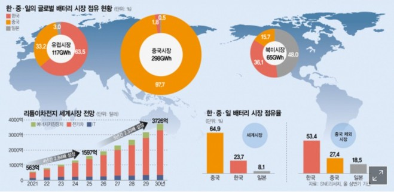
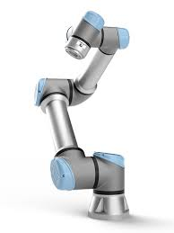
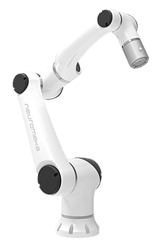
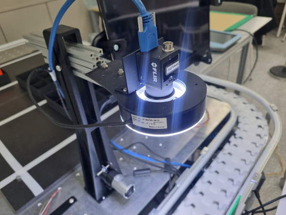
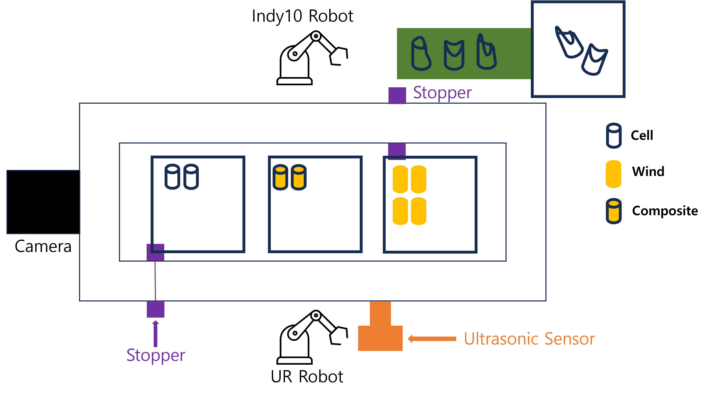

# 25-2 Robot Automation: Battery Winding Manipulation Automation

**Date:** 2025/12/27

**Author:** Joungbin Choi, Hyeongyu Seo, Inyeop Kim

**Advisor:** Professor YK Kim

**Github:** [repository link](https://github.com/Joungbin-C/IAIA_Robot_Automation_25-2)

**Demo Video:** [**Demo Video**](https://youtu.be/vMVNzXjdA7o)

***

## I. Introduction

With the rapid growth of the electric vehicle (EV) market, the secondary battery industry has emerged as a key strategic sector. It is projected that by 2030, electric vehicles will account for more than 40% of the global automotive market, leading to a significant increase in battery production demand[1]. However, conventional battery cell assembly and disassembly processes remain highly dependent on manual labor, resulting in limitations in productivity, process consistency, and quality control. In particular, as the importance of battery recycling and safe disassembly increases, there is a growing demand for intelligent automation systems capable of handling precise and complex operations beyond simple assembly tasks.

This project aims to address these challenges by developing an **automated battery cell winding process using industrial robots integrated with machine vision and artificial intelligence technologies**. By combining robotic manipulation, sensor-based detection nodes, state diagram–based control logic, and camera-based recognition of battery cells and winding components, the project seeks to transform a labor-intensive process into a high-speed, high-precision automated system. Through this approach, the feasibility of improving productivity, reliability, and safety in battery manufacturing and recycling processes is investigated.

## II. Problem Statement

### 1. Project Objectives

The main objectives of this project are as follows:

1. **Implementation of Automated Assembly and Disassembly of Battery Cell Winding Processes**
   To automate the assembly and disassembly of battery cells and winding components using industrial robots, thereby minimizing human error and improving repeatability.
2. **Development of a Machine Vision–Based Recognition System**
   To detect battery cell positions, orientations, and conditions (normal or defective) using camera-based vision systems and AI models, and to integrate the recognition results into the robot control system.
3. **Design of Robot Control Logic and State Diagrams**
   To design structured state diagrams that manage process flow and ensure stable coordination between sensor detection nodes and robotic actions.
4. **Verification of Process Reliability and Performance**
   To experimentally evaluate the success rate, accuracy, and operational stability of the automated system and assess its applicability to real industrial environments.

### 2. Expected Outcomes

The expected outcomes of this project are as follows:

1. **Improved Productivity and Operational Efficiency**
   By replacing manual labor with robotic automation, continuous operation beyond traditional working hours becomes possible, significantly increasing overall productivity.
2. **Enhanced Accuracy and Quality Consistency**
   The automated system is expected to achieve a high success rate in assembly and disassembly tasks, while the machine vision system enables reliable identification of normal and abnormal battery cells, excluding specific inclusion cases.
3. **Reduced Labor Dependency and Improved Workplace Safety**
   Automating repetitive and potentially hazardous battery handling processes reduces worker exposure to risk and lowers dependence on skilled manual labor.
4. **Scalability for Battery Recycling and Future Smart Factory Applications**
   The proposed system can be extended to battery disassembly and recycling processes, providing a technological foundation for advanced smart factory and sustainable battery production systems.

### 3. Evaluation Index

| Process                    | Target                                                       |
| -------------------------- | ------------------------------------------------------------ |
| **UR5 Robot Operation**    | - Bracket detection success rate ≥ 98%  - Cell box detection success rate = 100%  - Pick and Place success rate ≥ 95%  - Stopper linkage success rate = 100%  - Assembly/Disassembly process completion time ≤ 1 minute |
| **Indy10 Robot Operation** | - Cell orientation detection success rate = 100%  - Foreign object detection success rate ≥ 95%  - Defective cell detection success rate ≥ 95%  - Stopper linkage success rate = 100%  - Winding assembly/disassembly process completion time ≤ 1 minute |
| **Defect Detection**       | - Defect detection success rate (cylindrical surface) ≥ 95%  - Defect detection success rate (flat surface) ≥ 80% |

### 4. Hardware

These are materials for manipulation. A bracket is moving with slide rail and cells will be putted on it. Lastly, winds will be assembled or disassembled with cells. 

UR5e(upper image) and Indy10(bottom image) are utilized for assembling and disassembling manipulation. Overall, UR5e is used to pick-and-place cells on the bracket or get off cells from bracket. Indy10 is used to assemble or disassemble winds from cells. If there is a defected cell, Indy10 get rid of it from the bracket. 

This is setup for machine vision to check the state of cells. There are two machine vision cameras: top-view and side-view. Top view camera checks for a circularity of cells and side camera checks for defects on the side of cells.

This is overall setup for battery wind manipulation. 

## III. Individual Report
**[UR5e](https://github.com/Joungbin-C/IAIA_Robot_Automation_25-2/tree/main/Report/Report_(Dis)assembly_Automation_Process/Report_(Dis)Assembly_Automation.md)**

**[Indy10](https://github.com/Joungbin-C/IAIA_Robot_Automation_25-2/blob/main/Report/Report_(De)Compose_process/Report_(De)Compose_process.md)**

**[Machine Vision](https://github.com/Joungbin-C/IAIA/blob/main/Project/Project2_RobotAutomation/Report/Project2_RobotAutomation_Joungbin_22200757.md)**
