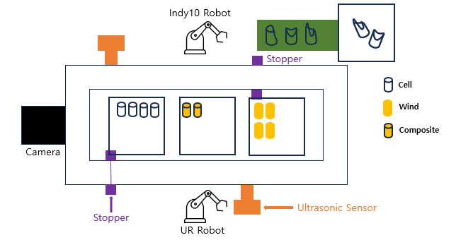
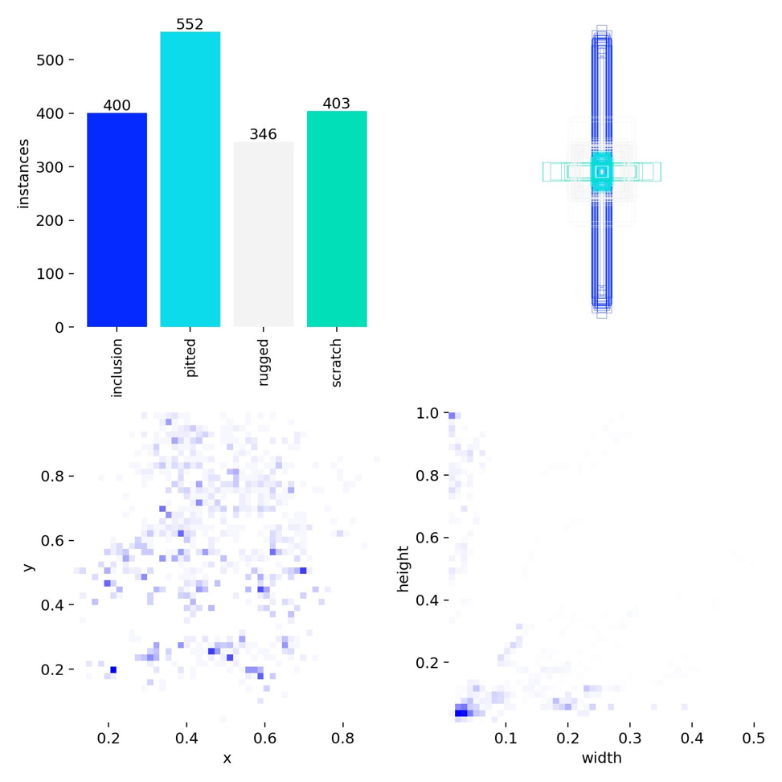
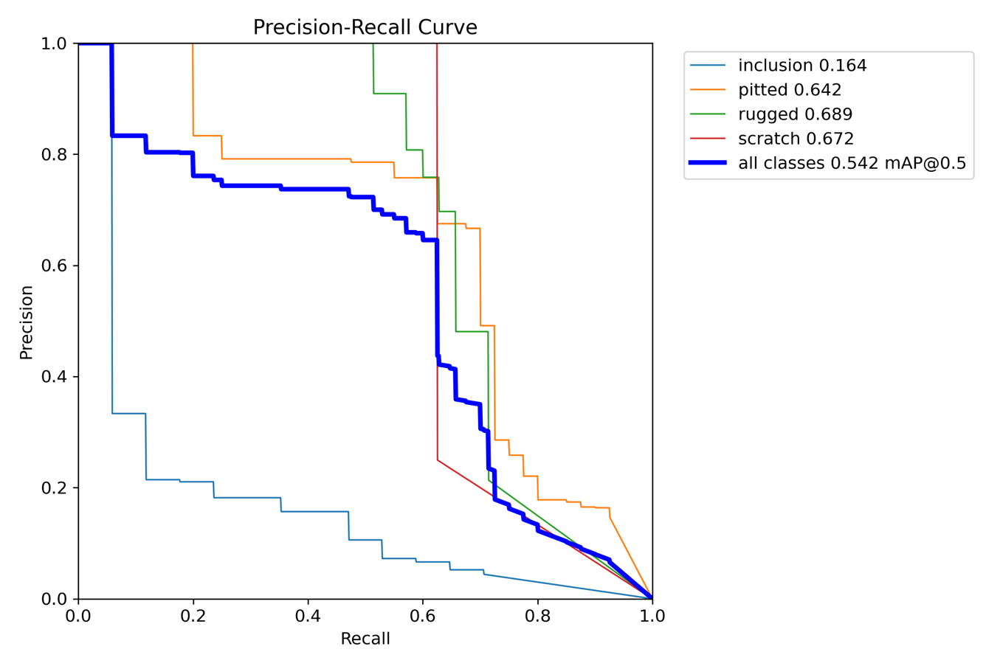
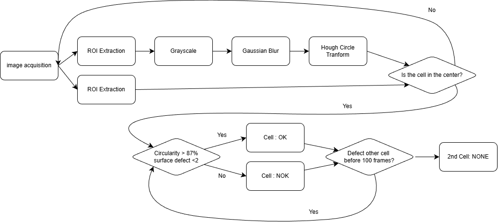
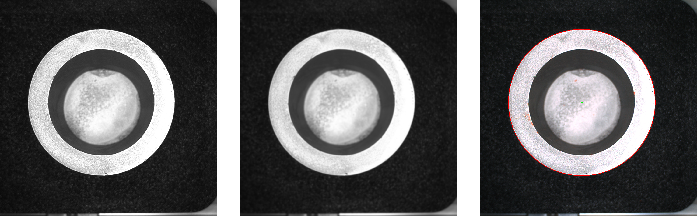
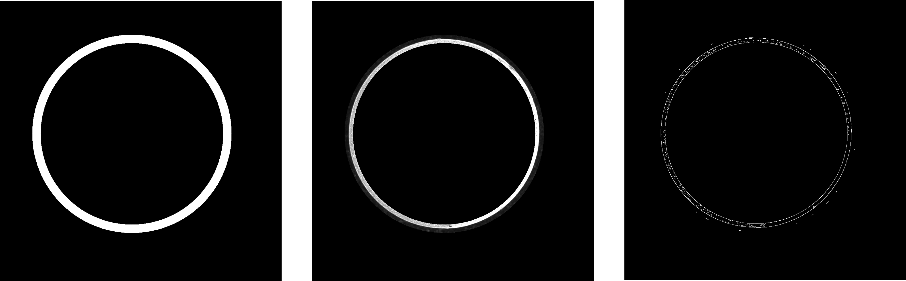
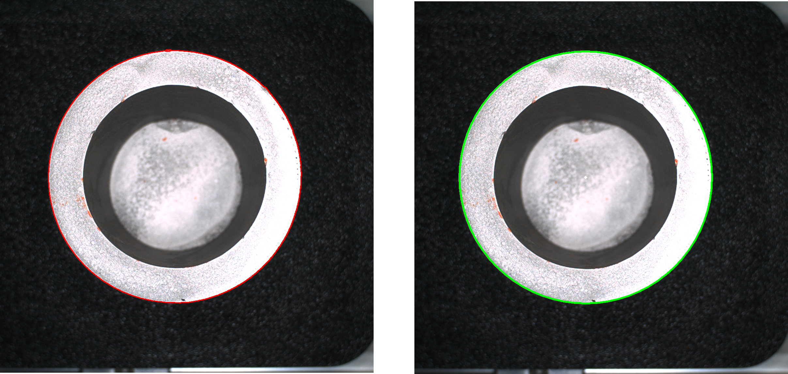
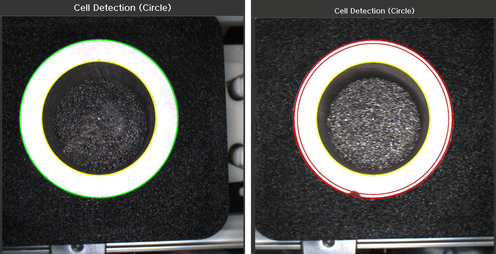

# LAB Report Template (Deep Learning)

**Date:** 2025/12/25

**Author:** Joungbin Choi

**Github:** [repository link](https://github.com/Joungbin-C/IAIA_Robot_Automation_25-2/tree/main)

**Demo Video:** [Youtube link](https://youtu.be/vMVNzXjdA7o)

***

## I. Introduction

With the rapid growth of the electric vehicle (EV) market, the secondary battery industry has emerged as a key strategic sector. It is projected that by 2030, electric vehicles will account for more than 40% of the global automotive market, leading to a significant increase in battery production demand[1]. However, conventional battery cell assembly and disassembly processes remain highly dependent on manual labor, resulting in limitations in productivity, process consistency, and quality control. In particular, as the importance of battery recycling and safe disassembly increases, there is a growing demand for intelligent automation systems capable of handling precise and complex operations beyond simple assembly tasks.

This project aims to address these challenges by developing an **automated battery cell winding process using industrial robots integrated with machine vision and artificial intelligence technologies**. By combining robotic manipulation, sensor-based detection nodes, state diagram–based control logic, and camera-based recognition of battery cells and winding components, the project seeks to transform a labor-intensive process into a high-speed, high-precision automated system. Through this approach, the feasibility of improving productivity, reliability, and safety in battery manufacturing and recycling processes is investigated.

## II. Problem Statement

### 1. Project Objectives

The main objectives of this project are as follows:

1. **Implementation of Automated Assembly and Disassembly of Battery Cell Winding Processes**
    To automate the assembly and disassembly of battery cells and winding components using industrial robots, thereby minimizing human error and improving repeatability.
2. **Development of a Machine Vision–Based Recognition System**
    To detect battery cell positions, orientations, and conditions (normal or defective) using camera-based vision systems and AI models, and to integrate the recognition results into the robot control system.
3. **Design of Robot Control Logic and State Diagrams**
    To design structured state diagrams that manage process flow and ensure stable coordination between sensor detection nodes and robotic actions.
4. **Verification of Process Reliability and Performance**
    To experimentally evaluate the success rate, accuracy, and operational stability of the automated system and assess its applicability to real industrial environments.

### 2. Expected Outcomes

The expected outcomes of this project are as follows:

1. **Improved Productivity and Operational Efficiency**
    By replacing manual labor with robotic automation, continuous operation beyond traditional working hours becomes possible, significantly increasing overall productivity.
2. **Enhanced Accuracy and Quality Consistency**
    The automated system is expected to achieve a high success rate in assembly and disassembly tasks, while the machine vision system enables reliable identification of normal and abnormal battery cells, excluding specific inclusion cases.
3. **Reduced Labor Dependency and Improved Workplace Safety**
    Automating repetitive and potentially hazardous battery handling processes reduces worker exposure to risk and lowers dependence on skilled manual labor.
4. **Scalability for Battery Recycling and Future Smart Factory Applications**
    The proposed system can be extended to battery disassembly and recycling processes, providing a technological foundation for advanced smart factory and sustainable battery production systems.

### 3. Evaluation Index

| Process                    | Target                                                       |
| -------------------------- | ------------------------------------------------------------ |
| **UR5 Robot Operation**    | - Bracket detection success rate ≥ 98%  - Cell box detection success rate = 100%  - Pick and Place success rate ≥ 95%  - Stopper linkage success rate = 100%  - Assembly/Disassembly process completion time ≤ 1 minute |
| **Indy10 Robot Operation** | - Cell orientation detection success rate = 100%  - Foreign object detection success rate ≥ 95%  - Defective cell detection success rate ≥ 95%  - Stopper linkage success rate = 100%  - Winding assembly/disassembly process completion time ≤ 1 minute |
| **Defect Detection**       | - Defect detection success rate (cylindrical surface) ≥ 95%  - Defect detection success rate (flat surface) ≥ 80% |

## III. Requirements

Write a list of HW/SW requirements.

### 1. Hardware List

* Computer
* 2 Spinnaker Cameras
* Slide Rail
* 2 Stepper Motors
* 2 Ardunio Boards
* 2 Ultrasonic Sensors
* Windings, Cells, Brakets
* Light

### 2. Software List

* CUDA 13.0
* cudatoolkit 12.6
* Python 3.10.8
* Pytorch 2.7.0+cu128
* YOLO v8
* Spinnaker SDK
* Spinnaker Python
* Numpy 2.2.6
* opencv python headless 4.10.0.84
* ultralytics 8.3.232
* PyQT5 5.15.11
* Pillow 9.2.0

### 3. Dataset

For surface detection of the cell, the dataset is customized. There are 4 classes: rugged, pitted, inclusion, and scratch

**Dataset link:** [download link](https://universe.roboflow.com/jb-edsws/surface-detecting-bdnua/dataset/2) 

***

## IV. Installation and Procedure

### 1. Hardware Setup

**Figure 1. Hardware Overview**

This image show hardware Setup:

1. UR5 and Indy10 robots are placed between the stopper(stepper motors) and ultrasonic sensors. If ultrasonic sensors detect the bracket, stopper is closed.
2. Cameras are placed upper and side of the rail. Upper camera check the circularity of the cell and side camera check the surface of the cell.

**Figure 2. Camera Setup**

### 2. Software Installation

For software installation of machine vision part, you can find the instruction in this [github link](https://github.com/Joungbin-C/IAIA/tree/main/Project/Project2_RobotAutomation)

### 3. Data Preparation

This dataset is customized and total number of data is 1,701.

train data : 90%

validation data : 7% 

test data : 3%

**Figure 3. Dataset Distribution**

The original data was unbalanced. Inclusion and scratch are much less than others, so oversampling was proceeded. Final balanced dataset is shown in **Figure 3**.

### 4. Train model

YOLO (You Only Look Once) is a real-time object detection model that simultaneously performs object localization and classification in a single forward pass of a neural network. By processing the entire image at once rather than using a multi-stage detection pipeline, YOLO achieves high inference speed with relatively low computational complexity. The model divides the input image into a grid and predicts bounding boxes, confidence scores, and class probabilities for each grid cell, enabling efficient and accurate object detection. Due to its fast response time and robustness, YOLO is widely used in applications such as industrial automation, robotic pick-and-place systems, defect detection, and real-time machine vision–based control systems[2].

**Table 1. Hyperparameter of Surface Defect Detection Model**

| Parameter   | Number          |
| ----------- | --------------- |
| Model       | YOLOv8s         |
| Epoch       | 100             |
| Batch       | 8               |
| Optimizer   | AdamW(lr=0.001) |
| Early Stop  | 20              |
| Final Epoch | 53              |

**Figure 4. Training Result Confusion Matrix**

**Figure 5. PR Curve Graph**

**Table 2. Defect Classes**

| Class     | Description       |
| --------- | ----------------- |
| Rugged    | Rough surfeace    |
| Pitted    | Indented defect   |
| Inclusion | Foreign inclusion |
| Scratch   | Scratch defect    |

Thin and elongated inclusion defects are difficult to detect because their small size, low contrast, and extreme aspect ratios are poorly represented in bounding box–based object detection models, leading to feature loss and insufficient learning during training[5].

***

## V. Method

### 1. Overview

This study proposes an automated battery cell inspection system that integrates a **dual-camera machine vision setup with traditional image processing techniques and a deep learning–based surface defect detection model**. The system consists of two industrial FLIR cameras, OpenCV-based geometric analysis, a YOLO-based deep learning model, and a socket-based communication interface for external device control.

Camera 1 is responsible for **cell geometry analysis**, including circular shape detection, edge-based crack inspection, and thickness measurement. Camera 2 performs **surface defect detection** using a YOLO-based object detection model. The inspection process follows a state-based logic in which two consecutive cells (Cell 1 and Cell 2) are evaluated and their results are combined to generate a final decision flag.

**Figure 6. Flow Chart**

### 2. Preprocessing

Preprocessing steps were designed separately for each camera according to its inspection purpose.

For Camera 1, a fixed-size **region of interest (ROI)** centered in the image was extracted to remove unnecessary background information. The ROI image was converted to grayscale and smoothed using Gaussian blur to reduce noise. Circular features of the battery cell were detected using the **Hough Circle Transform**, and the detected outer circle was used to define an edge ring region. **Canny edge detection** was applied within this region to emphasize crack-related features[3]. 

**Figure 7. Preprocessing: Grayscale, Gaussian blur, Hough Circle,  Ring Mask, Ring ROI, Canny Edge,  Contour, and Result**

Contour extraction and circularity analysis were then used to determine the presence of edge cracks.
$$
Circularity= \frac{4πA} {P^2}
$$
For Camera 2, a centered ROI was extracted from the original color image and directly passed to the YOLO model without additional color conversion. This approach preserves surface texture and intensity variations, which are critical for surface defect detection. Input resizing and normalization were handled internally by the YOLO framework.

### 3. Deep Learning Model

A **YOLOv8-based object detection model** was employed for surface defect detection[4]. YOLO (You Only Look Once) is a single-stage object detection framework that simultaneously predicts object locations and class probabilities in a single forward pass, enabling real-time performance.

**Figure 8. Surface Detection Result**

YOLOv8 offers improved detection accuracy and computational efficiency compared to previous YOLO versions, making it suitable for real-time industrial inspection systems. In this study, a fine-tuned YOLOv8 model trained on a battery surface defect dataset was used. The model outputs bounding boxes and confidence scores for detected surface defects, and the number of detected defects is used as a criterion for surface quality assessment.

### 4. Postprocessing

#### **Algorithm #1: Cell Geometry and Edge-Based Defect Decision**

The first postprocessing algorithm evaluates the geometric validity of the detected battery cell and determines edge-related defects. The detected outer circle must satisfy predefined radius and area thresholds to be considered valid. An edge ring region is then analyzed using contour-based circularity metrics to identify potential cracks. Final decisions are made only when the detected cell is sufficiently centered in the image, reducing false detections caused by partial or misaligned cells.

#### **Algorithm #2: Cell Pairing and Decision Fusion Algorithm**

The second algorithm fuses the inspection results of two consecutive cells (Cell 1 and Cell 2). Each cell is classified as OK or NOK, and their combined results are mapped to predefined numeric flags for external communication. A timeout mechanism is implemented to handle cases where the second cell is not detected within a specified number of frames, ensuring robust operation in continuous production environments.

### 5. Experiment Method

Experiments were conducted under continuous image acquisition conditions that simulate real industrial inspection environments. Two FLIR cameras were operated in continuous acquisition mode, and multiple samples of normal and defective battery cells were tested.

The evaluation metrics included:

- Circle detection success rate
- Surface defect detection success rate using YOLO

## VI. Results and Analysis

**Figure 9. Top Camera Result**

The accuracy of the circularity-based decision logic was evaluated through a total of 105 inspection trials. Among these, 53 defective cells and 52 normal cells were passed through the system to verify the correctness of the classification results. The experimental results showed that both normal cells (Cell Okay) and defective cells (Cell Not Okay) achieved accuracy levels exceeding the target threshold of 95%. This indicates that the circularity-based decision method provides high reliability and robustness for detecting edge cracks on battery cells. In particular, the method maintained consistent performance even under conditions with image noise and variations in illumination.

**Table 3. Circularity Accuracy Table**

| Classification | Target Accuracy [%] | Detection Result | Result Accuracy [%] |
| -------------- | ------------------- | ---------------- | ------------------- |
| Cell Okay      | ≥ 95                | 102 / 105        | **97.14**           |
| Cell Not Okay  | ≥ 95                | 100 / 105        | **95.24**           |

**Figure 10. Side Camera Result**

For surface defect detection, the success rate was recorded by passing 50 samples for each defect class through the system. The results showed that the Pitted, Rugged, and Scratch defect classes all satisfied the target accuracy of 80% or higher. Among them, the Pitted defect achieved a notably high detection success rate of 94%. This performance can be attributed to the relatively large defect area and the clear texture contrast between the defect and the surrounding surface, which allowed the YOLO model to learn discriminative features effectively.

In contrast, the Inclusion defect exhibited a significantly lower detection success rate of 48%, failing to meet the target performance. Inclusion defects typically have thin and elongated shapes, low contrast relative to the surface, and high variability in appearance. As a result, feature information is often lost in bounding box–based object detection models, leading to poor detection performance. This outcome highlights a structural limitation of YOLO-based models when applied to small and slender defect types.

**Table 4. Side Defect Detection Accuracy Table**

| Defect Type | Target Accuracy [%] | Detection Result | Result Accuracy [%] |
| ----------- | ------------------- | ---------------- | ------------------- |
| Inclusion   | ≥ 80                | 24 / 50          | **48**              |
| Pitted      | ≥ 80                | 47 / 50          | **94**              |
| Rugged      | ≥ 80                | 43 / 50          | **86**              |
| Scratch     | ≥ 80                | 43 / 50          | **86**              |

***

## VII. Conclusion

This project presented an automated battery cell inspection system that combines image processing and deep learning techniques. A dual-camera setup was used, where one camera performed cell shape inspection using circularity analysis, and the other camera detected surface defects using a YOLO-based model.

The circularity-based inspection showed reliable performance, achieving accuracy above the target value of 95% for both normal and defective cells. This result confirms that the proposed method is effective for detecting edge cracks under various imaging conditions. For surface defect detection, the YOLO model successfully detected Pitted, Rugged, and Scratch defects with accuracy higher than the target of 80%. However, the detection performance for Inclusion defects was relatively low due to their thin shape and low contrast.

In addition, the performance observed during testing was higher than that indicated by the confusion matrix obtained during training. This is because various data augmentation techniques such as adding noise and adjusting brightness were applied to the training dataset to improve robustness. In contrast, the real-world environment had fixed lighting and stable conditions, which resulted in higher detection accuracy.

Future work should focus on improving the detection of Inclusion defects by using higher-resolution images, more training data, or segmentation-based models. Additional experiments under different lighting conditions will also help improve the overall reliability of the system.

## Reference

[1] Y. Park, “Battery Industry Competition: Challenges for Korean Battery Companies amid China’s Rapid Growth,” *Seoul Economic Daily*, Nov. 17, 2024. Available: https://www.sedaily.com/NewsView/29X4QWC74S

[2] J. Redmon, S. Divvala, R. Girshick, and A. Farhadi, “You Only Look Once: Unified, Real-Time Object Detection,” *Proceedings of the IEEE Conference on Computer Vision and Pattern Recognition (CVPR)*, pp. 779–788, 2016.

[3] OpenCV, “OpenCV Documentation,” OpenCV Official Documentation. Available: https://docs.opencv.org

[4] Ultralytics, “YOLOv8 Documentation,” Ultralytics Official Documentation. Available: https://docs.ultralytics.com

[5] Y. Zhang, J. Yang, and Z. Liu, “Surface Defect Detection Based on Deep Learning: A Review,”
 *Journal of Manufacturing Systems*, vol. 62, pp. 682–695, 2022.

***

## Appendix

### 1. Team Contribution

| Name          | Job Descriptions         |
| ------------- | ------------------------ |
| Inyeop Kim    | UR5 manipulation         |
| HyeonGyu Seo  | Indy10 Manipulation      |
| Joungbin Choi | Hardware, Machine Vision |

### 2. Combined Works

This report covers deep learning-based and machine vision cell defect detection.

Process recognition-based pick and place automation with Indy10 and UR5 are covered in the following links.

[Indy10](https://github.com/shg0873/IAIA/tree/main/Project/Project2_RobotAutomation/Report)

[UR5](https://github.com/Kiminyeop-cpu/Robot-Automation/blob/main/Battery%20Cell%20Winding%20Process.pdf)

